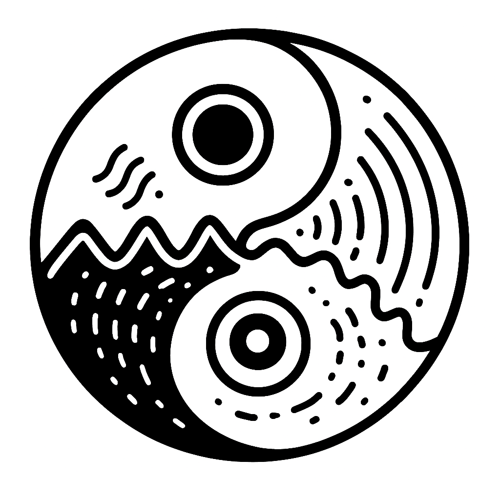

# Balancing Polarity (P0)

> The difference-balancing pole in a polarity system that represents differential equilibrium, neutral regulation, and sustainable integration through homeostatic coordination.

---

## Definition

Balancing Polarity (P0) represents the difference-balancing, homeostatic aspect of a polarity system that maintains equilibrium between differential intake (P+) and outflow (P-). It emerges through relational embedding and manifests when systems achieve sustainable difference balance, mediating between active and structural poles to enable stable evolution.

---

## Dual-register mapping

### Technical (network/computational)

| Term concept | Network construct | Interface example |
|-------------|------------------|-------------------|
| Phase mediation | Synchronizer | `PhaseCoordinator` |
| Integration | State combiner | `DifferenceIntegrator` |
| Transition control | Phase manager | `TransitionController` |

### Humane (biological/relational)

| Term concept | Humane construct | Example |
|-------------|------------------|----------|
| Phase mediation | Harmonizing | "Finding balance" |
| Integration | Understanding | "Bringing together" |
| Transition control | Flow guidance | "Smooth changes" |

### Crosswalk (bridge)

| Technical term | Humane term | Ontological meaning |
|---------------|-------------|-------------------|
| Synchronization | Harmony | Phase coherence |
| State combination | Integration | Unified difference |
| Phase management | Flow guidance | Coherent evolution |

### Domain Examples

| Domain | Technical manifestation | Humane manifestation |
|--------|------------------------|---------------------|
| Physics | Neutron stabilization | Nuclear balance mediation |
| Chemistry | Catalyst moderation | Reaction balance |
| Biology | Homeostatic regulation | Living balance |
| Networks | Protocol bridging | Connection harmony |
| Cognition | Integration synthesis | Understanding balance |
| Social | Conflict resolution | Community harmony |
| Systems | Phase coordination | Balanced evolution |

---

## Scale Effects

How Balancing Polarity manifests differently at various scales:

### Micro Scale (ε-bounded)
- **Resolution effects:** Quantum superposition maintains balance between states
- **Example:** Particle-wave duality equilibrium

### Human Scale (ψA-bounded)
- **Coherence effects:** Conscious integration balances competing processes
- **Example:** Homeostatic regulation in living systems

### Cosmic Scale (c-bounded)
- **Causal effects:** Large-scale equilibrium maintains universal stability
- **Example:** Galactic rotation curves, dark matter balance

**Scale transitions:** At extreme scales, balancing may present as its polarity opposites due to fundamental limits.

---

## Ontological Role

| Domain | Role |
|--------|------|
| Structure | Mediates structural formation |
| Void | Balances void dynamics |
| Awareness | Maintains coherent integration |

Balancing Polarity is the **equilibrium-maintaining** dimension of the triadic system.

---

## Comparisons

Compare with related terms to clarify boundaries:

| This term | Related term | Key distinction |
|-----------|-------------|----------------|
| Balancing Polarity | Active Polarity | Balancing maintains equilibrium; Active drives change |
| Balancing Polarity | Structural Polarity | Balancing mediates; Structural stabilizes |
| Balancing Polarity | Awareness | Balancing focuses on equilibrium; Awareness on coherence |

---

## See Also

- [[polarity.glossary|Polarity (glossary)]]
- [[active-polarity.glossary|Active Polarity (glossary)]]
- [[structural-polarity.glossary|Structural Polarity (glossary)]]
- [[structure.glossary|Structure (glossary)]]
- [[void.glossary|Void (glossary)]]
- [[awareness.glossary|Awareness (glossary)]]
