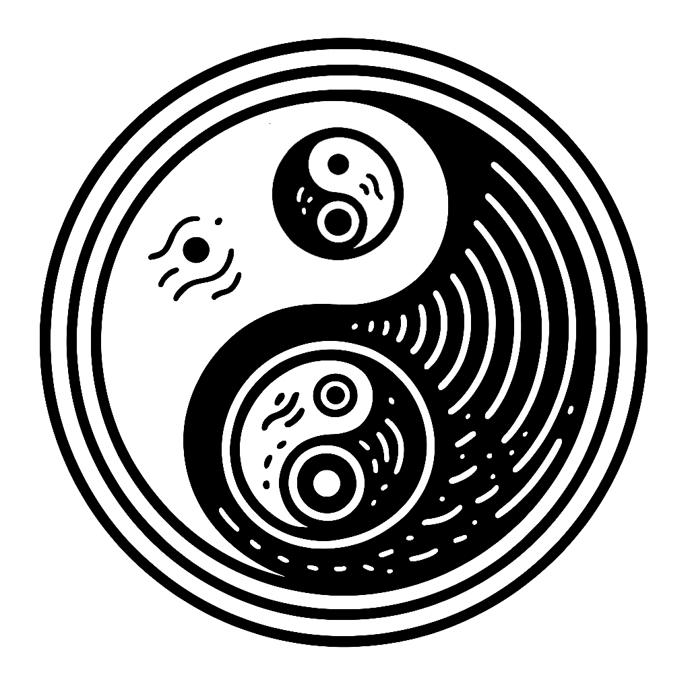

# Structural Polarity (P+)

> The structure-building pole in a [[polarity.glossary|Polarity (glossary)]] system that represents difference intake, self-contained forms, and autonomous structure generation through satisfied differential states.

---

## Definition

Structural Polarity (P+) represents the structure-building, self-contained aspect of a polarity system that operates from differential satiety to create autonomous forms. It emerges from [[delta.primitive|Primitive Difference]] through relational embedding and manifests when systems have sufficient difference accumulation to build internal structure rather than seek external resources. Contains P-(n+1) at its core through nested counter-rotation.

**Note on Energy-Difference Relationship:** In domain-specific manifestations, accumulated differences appear as various forms of energy (potential, kinetic, chemical, etc.). Energy is thus a domain projection of the more fundamental ∆ substrate—the capacity to make differences manifest as measurable work or transformation potential.

---

## Dual-register mapping

### Technical (network/computational)

| Term concept | Network construct | Interface example |
|-------------|------------------|-------------------|
| Structure building | Form generator | `StructureBuilder` |
| Difference consolidation | Resource integrator | `DifferenceConsolidator` |
| Nested stability | Counter-rotation | `NestedStabilizer` |

### Humane (biological/relational)

| Term concept | Humane construct | Example |
|-------------|------------------|----------|
| Structure building | Creative construction | "Building something new" |
| Difference consolidation | Satisfaction feeling | "Having enough to create" |
| Nested stability | Inner balance | "Stable while moving" |

### Crosswalk (bridge)

| Technical term | Humane term | Ontological meaning |
|---------------|-------------|-------------------|
| Form generation | Creative construction | Origin of structure |
| Resource integration | Difference satisfaction | Autonomous building |
| Counter-rotation | Inner balance | Stable dynamics |

### Domain Examples

| Domain | Technical manifestation | Humane manifestation |
|--------|------------------------|---------------------|
| Physics | Electron bond formation | Creative force dynamics |
| Chemistry | Molecular structure creation | Chemical creativity |
| Biology | Growth processes | Living expansion |
| Networks | Node structure building | Connection consolidation |
| Cognition | Neural activation | New learning |
| Social | Innovation drivers | Creative movements |
| Systems | State generation | Creative evolution |

---

## Scale Effects

How Structural Polarity manifests differently at various scales:

### Micro Scale (ε-bounded)

| Constant | Effect | Example |
|----------|--------|---------|
| ε | Minimum difference generation | Quantum fluctuation |
| λV | Interface activation threshold | Potential barrier |

### Human Scale (ψA-bounded)

| Constant | Effect | Example |
|----------|--------|---------|
| ψA | Coherent change perception | Noticeable shift |
| ∇S | Structural differentiation | Clear distinction |

### Cosmic Scale (c-bounded)
- **Causal effects:** Large-scale autonomous structure formation through self-contained dynamics
- **Example:** Star formation, planetary systems, and galactic structure building

**Scale transitions:** At extreme scales, structural polarity may present as its polarity opposites due to fundamental limits.

---

## Ontological Role

| Domain | Role |
|--------|------|
| Structure | Generates autonomous forms and self-contained systems |
| Void | Creates internal coherence and difference consolidation |
| Awareness | Maintains stable structural patterns and form recognition |

Structural Polarity is the **structure-building** dimension of the triadic system, creating autonomous forms through difference consolidation.

---

## Comparisons

Compare with related terms to clarify boundaries:

| This term | Related term | Key distinction |
|-----------|-------------|----------------|
| Structural Polarity | [[active-polarity.glossary|Active Polarity (glossary)]] | Structural generates change; Active seeks resources |
| Structural Polarity | [[balancing-polarity.glossary|Balancing Polarity (glossary)]] | Structural creates forms; Balancing mediates |
| Structural Polarity | [[structure.glossary|Structure (glossary)]] | Structural Polarity is dynamic building; Structure is stable form |

---

## See Also

- [[polarity.glossary|Polarity (glossary)]] — Parent structural primitive
- [[active-polarity.glossary|Active Polarity (glossary)]] — Complementary pole
- [[balancing-polarity.glossary|Balancing Polarity (glossary)]] — Mediating pole
- [[universal-polarities-recursive-stabilization-through-triadic-rotation.meta|Universal Polarities — Recursive Stabilization Through Triadic Rotation]] — Metaphorical framework
- [[bio-tech-co-evolution-recursive-stabilization-through-mutual-dependency.meta|Alternating Polarity — Recursive Stabilization Through Phase Opposition]] — Phase dynamics